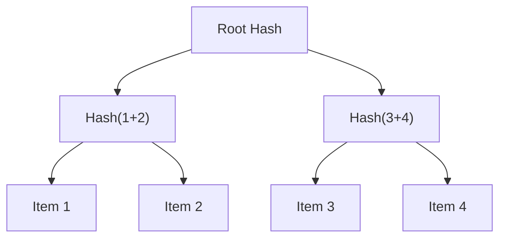

# Proof of Membership for EVM

Proof of Membership allows you to verify that an item is part of a set without revealing the entire set.

⚠️ **Early Stage Project**: This package is under active development. APIs may change as we improve the implementation.


## Installation

```bash
bun add @zkthings/proof-membership-evm
# or
npm install @zkthings/proof-membership-evm
```

## Quick Start

```typescript
import { ZkMerkle } from '@zkthings/proof-membership-evm';

// Create a new ZK Merkle Tree
const zkMerkle = new ZkMerkle();

// Add data and generate proof
const values = ['Dragon Tree', 'Olive' , 'Linden']

const { proof, publicSignals } = await zkMerkle.generateMerkleProof(
  values,
  'Dragon Tree'
);

// Verify off-chain (for testing)
const isValidOffChain = await zkMerkle.verifyProof(proof, publicSignals);

// Export and deploy verifier contract
const verifierContract = await zkMerkle.exportVerifierContract();
```


## Built on Merkle Proofs
We use Merkle trees to achieve this. Here's a brief overview:

1. **Array of Items**: Start with your list of items (e.g., addresses).
2. **Tree Structure**: Organize these items into a tree structure.
3. **Hashing**: Each item is hashed, and these hashes are paired and hashed again.
4. **Root Hash**: This process continues until a single hash, the "root hash," is obtained.



The Merkle root acts as a unique fingerprint for your entire list. To prove that an item is part of the list, a user only needs to share a small set of intermediary hashes, known as a "Merkle proof," that link their item to the root. If the proof hashes align with the root, it verifies that the item belongs to the original list without needing to reveal the entire list.

## Process Overview

1. **Generate a Proof**
   - Use the SDK to generate a proof for an item in your list.
   - This involves hashing the item and combining it with other hashes to form a path to the root.

```typescript
import { ZkMerkleTree } from '@zkthings/proof-membership-evm';

// Initialize the Merkle tree
const zkMerkle = new ZkMerkleTree();

// Your data array
const allowlist = ['0x123...', '0x456...', '0x789...'];

// Generate proof for a specific item
const { proof, publicSignals } = await zkMerkle.generateMerkleProof(
  allowlist,
  '0x123...'
);
```

2. **Export Verifier Contract**
   - Instead of verifying directly on-chain, export a verifier contract.
   - Deploy this contract to handle on-chain verification.

```typescript
// Export and deploy verifier contract
const verifierContract = await zkMerkle.exportVerifierContract();
```

3. **Verify the Proof Off-Chain**
   - Use off-chain verification for testing purposes.

```typescript
// Off-chain verification
const isValidOffChain = await zkMerkle.verifyProofOffChain(
  proof,
  publicSignals
);
```

## Moving from Test to Production

### Trusted Setup
A trusted setup is a crucial security process that creates the cryptographic parameters needed for zero-knowledge proofs. It requires multiple participants to ensure no single party has access to the complete setup information.

The setup process happens in two phases:
1. Phase 1 (Powers of Tau): General setup that can be reused
2. Phase 2: Circuit-specific setup for Merkle Tree operations

#### Coordinator Setup
```typescript
import { PowerOfTau } from '@zkthings/proof-membership-evm';

// Initialize ceremony
const ceremony = new PowerOfTau(15);  // For trees up to depth 15

// 1. Initialize ceremony
const ptauFile = await ceremony.initCeremony();

// 2. Share ptauFile with participants
// Each participant must contribute sequentially

// 3. After receiving final contribution
await ceremony.finalizeCeremony();

// 4. Generate production parameters
await ceremony.initPhase2('MerkleTreeProof');
await ceremony.finalizeCircuit('MerkleTreeProof');
```

#### Participant Contribution
```typescript
import { PowerOfTau } from '@zkthings/proof-membership-evm';

// Each participant runs this
const ceremony = new PowerOfTau(15);

// Import previous contribution
await ceremony.importContribution(ptauFile);

// Add contribution
const newPtau = await ceremony.contributePhase1(`Participant ${id}`);

// Send newPtau to next participant or coordinator
```

#### Ceremony Flow
1. Coordinator initializes: `pot15_0000.ptau`
2. Participant 1 contributes: `pot15_0001.ptau`
3. Participant 2 contributes: `pot15_0002.ptau`
4. Final participant returns to coordinator
5. Coordinator finalizes ceremony

### Production Deployment
```typescript
// Use custom ceremony output
const zkMerkle = new ZkMerkleTree({
  baseDir: './production-zkconfig',
  maxDepth: 20
});

// Deploy verifier contract
const verifierContract = await zkMerkle.exportVerifierContract();
```

## Architecture

```
📦 @zkthings/proof-membership-evm
├── core/             # Core Merkle Tree implementation
├── circuits/         # Circom circuit definitions
├── contracts/        # Solidity verifier contracts
└── ceremony/         # Trusted setup utilities
```

## Best Practices

### Local Development
```typescript
// Fast local testing
const zkMerkle = new ZkMerkleTree();
const isValid = await zkMerkle.verifyProofOffChain(proof, publicSignals);
```

### Production Setup
```typescript
// Secure production configuration
const zkMerkle = new ZkMerkleTree({
  baseDir: './production-zkconfig',
});
```

## Contributing

PRs welcome! Check our [Contributing Guide](https://github.com/zkthings/proofOfMembership-evm/blob/main/CONTRIBUTING.md).

## Support

- [Documentation](https://zksdk.io/docs/intro)
- [GitHub Issues](https://github.com/zkthings/proofOfMembership-evm/issues)

## License

MIT © [zkThings](https://github.com/zkthings) 
