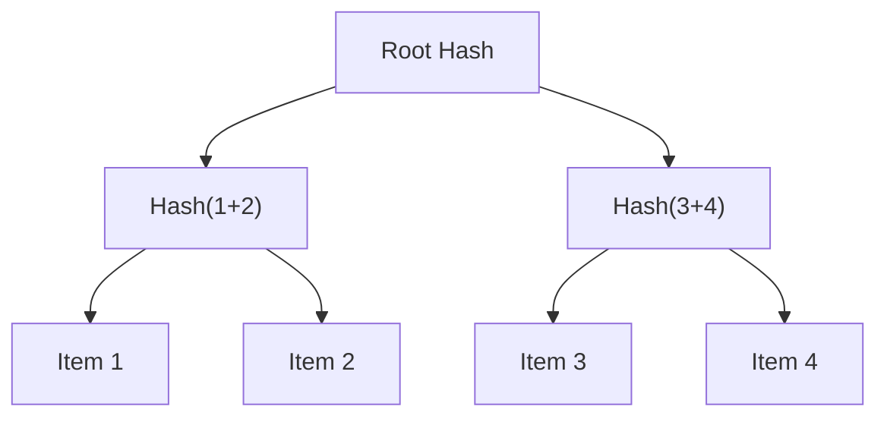

# Proof of Membership for Mina

Zero-Knowledge Merkle Tree implementation for Mina Protocol, powered by o1js.

**Early Stage Project**: This package is under active development. APIs may change as we improve the implementation.

**Not Released Yet**: This npm package is going through changes. If you need access to the codebase now, please contact us.


## Installation

```bash
bun add @zkthings/proof-membership-mina
# or
npm install @zkthings/proof-membership-mina
```

## Quick Start

```typescript
import { ZkMerkleTree, MerkleProver, deployZkApp } from '@zkthings/proof-membership-mina';
import { Mina, PrivateKey } from 'o1js';

// 1. Deploy Merkle Prover Contract
const deployment = await deployZkApp(MerkleProver, {
  network: 'local',
  proofsEnabled: true
});

// 2. Create and populate Merkle Tree
const zkMerkle = new ZkMerkleTree();
const values = ['Banyan', 'Sakura', 'Tembusu'];

// 3. Generate Proof
const { proof, publicSignals } = await zkMerkle.generateMerkleProof(
  values,
  'Tembusu',
  deployment.deployerAccount
);

// 4. Verify (choose method)
// Off-chain (fast, for testing)
const isValidOffChain = await zkMerkle.verifyProofOffChain(proof, publicSignals);

// On-chain (blockchain verification)
const isValidOnChain = await zkMerkle.verifyProofOnChain(
  deployment.contract,
  proof,
  publicSignals
);
```

## Built on Merkle Proofs
The Zk Merkle Tree for Mina leverages Merkle proofs to ensure efficient and secure verification of data membership within a set. Here's a brief overview:

1. **Array of Items**: Begin with your list of items (e.g., account addresses).
2. **Tree Structure**: Organize these items into a hierarchical tree structure.
3. **Hashing**: Each item is hashed, and these hashes are paired and hashed again.
4. **Root Hash**: This process continues until a single hash, the "root hash," is obtained.



The Merkle root acts as a unique fingerprint for your entire list. To prove that an item is part of the list, a user only needs to share a small set of intermediary hashes, known as a "Merkle proof," that link their item to the root. If the proof hashes align with the root, it verifies that the item belongs to the original list without needing to reveal the entire list.


## Moving from Test to Production

### Production Usage

```typescript
// Berkeley Testnet Setup
const Berkeley = Mina.Network('https://proxy.berkeley.minaexplorer.com/graphql');
Mina.setActiveInstance(Berkeley);

// Deploy with your credentials
const deployment = await deployZkApp(MerkleProver, {
  network: 'berkeley',
  deployer: {
    key: PrivateKey.fromBase58('YOUR_PRIVATE_KEY'),
    account: deployerAccount
  }
});
```

## Architecture

```
@zkthings/proof-membership-mina
├── ZkMerkleTree     # Core Merkle Tree implementation
├── MerkleProver     # On-chain verification contract
└── Utils
    └── deployZkApp  # Deployment helper
```

## Best Practices

### Local Development
```typescript
// Fast local testing
const deployment = await deployZkApp(MerkleProver, {
  network: 'local',
  proofsEnabled: false  // Faster for development
});
```

### Production Deployment
```typescript
// Secure production setup
const deployment = await deployZkApp(MerkleProver, {
  network: 'berkeley',
  proofsEnabled: true,  // Always true in production
  deployer: {
    key: deployerKey,
    account: deployerAccount
  }
});
```

## Contributing

PRs welcome! Check our [Contributing Guide](https://github.com/zkthings/merkle-mina/blob/main/CONTRIBUTING.md).

## Support

- [Documentation](https://zksdk.io/docs/intro)
- [GitHub Issues](https://github.com/zkthings/merkle-mina/issues)

## License

MIT © [zkThings](https://github.com/zkthings)