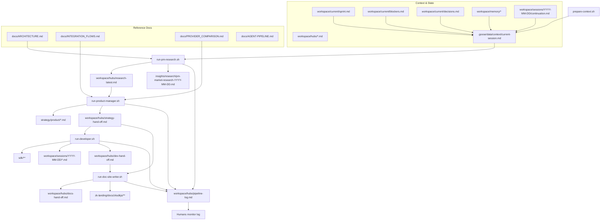

# Agent Pipeline Overview

This file is the single source of truth for how the folders, scripts, recipes, and agents fit together. Use it to understand what every directory is for, which Goose recipe touches it, and what the execution order looks like.

## Directory Map & Ownership

| Directory | Purpose | Read By | Written By | Notes |
|-----------|---------|---------|------------|-------|
| `.goose/` | Recipes, rules, and agent hints | All agents (recipes auto-load) | Maintainers | `data/context/current-session.md` is regenerated before each run. |
| `automation/scripts/` | Shell entrypoints and orchestrators | Operators, automation | Scripts themselves | Active wrappers: `prepare-context.sh`, `daily-run-strategy.sh`, `daily-run-dev.sh`, `run-*.sh`, `generate-daily-report.sh`, `start-new-session.sh`. |
| `automation/scripts/legacy/` | Archived one-off scripts | Humans (reference only) | — | Not part of the production pipeline. |
| `automation/recipes/` | YAML recipes for Goose | Goose CLI | Maintainers | `recipes/main/` (core workflow), `subrecipes/`, `specialists/`, `utilities/`. |
| `docs/` | Human-facing guides and architecture | Humans | Humans & docs agents | Includes `AGENT-PIPELINE.md`, `ARCHITECTURE.md`, `INTEGRATION_FLOWS.md`, `HOW-IT-WORKS.md`, etc. |
| `insights/daily/` | Immutable daily/weekly reports | Humans, docs agents | `generate-daily-report.sh`, docs agents | Dated taxonomy: `insights/daily/YYYY/MM-Month/DD/`. |
| `insights/research/` | Research vault (non-daily) | Humans, PM agents | Research agents (optional) | Use for long-form studies not tied to a specific day. |
| `strategy/active/` | Symlink to the current plan | All agents | Strategy Chief / PM | `current.md` points to the live strategy artifact. |
| `strategy/product/` | PM deliverables & strategy outputs | Strategy, dev, docs agents | `run-product-manager.sh` | Personas, requirements, GTM, architecture. |
| `strategy/roadmap/` | Long-term plans & integration tracks | Humans & agents | Humans/strategy agents | Canonical home for roadmap docs (duplication exists in `plans/`). |
| `strategy/decisions/` | ADRs and recorded decisions | Humans & agents | Humans/agents | Each ADR documents context + outcome. |
| `workspace/current/` | Sprint goals, blockers, decisions | All agents | Humans & agents | Must stay short-term; every automation step reads it. |
| `workspace/hubs/` | Hand-offs between agents | All agents & scripts | `run-*`, `daily-run-*` scripts | `research-latest.md`, `strategy-hand-off.md`, `dev-hand-off.md`, `docs-hand-off.md`, `pipeline-log.md`, `README.md`. |
| `workspace/sessions/` | Session notes & continuation guides | All agents | Scripts & humans | Organized by date (`workspace/sessions/YYYY-MM-DD/`). |
| `workspace/memory/` | Canonical agent memory/state | Role-specific recipes | Agents & humans | Persistent notes for agents; maintain here even though context builder does not auto-include it. |
| `memory/` | Legacy copy of agent memory | — | — | Duplicate of `workspace/memory/`; archive or remove after migration. |
| `knowledge/` | Future knowledge base | — | — | Currently empty; decide whether to populate or archive. |
| `reports/` | Deprecated research drop zone | — | — | No longer written; archive after moving any historical files into `insights/`. |
| `plans/` | Duplicate of `strategy/roadmap/` | — | — | Same files/size; remove once references move to roadmap. |
| `sdk/` | TypeScript workspace (core & providers) | Developer/tester agents | Developer/tester agents | Tests under `sdk/packages/**/__tests__`; builds with `npm run build`. |
| `examples/` | Example integrations | Docs/examples agents | `run-example-writer.sh`, humans | Mirrors SDK usage scenarios. |
| `privacy-cash-sdk/`, `goose/` | Vendor/upstream repositories | Humans | Humans | Consider submodules or moving outside repo to save space. |
| `defi_research/` | Legacy reference material | Humans (optional) | — | Keep as read-only archive until needed. |

### Directory Status Snapshot

- **Active**: `.goose/`, `automation/scripts/`, `automation/recipes/`, `docs/`, `insights/daily/`, `strategy/*`, `workspace/*`, `sdk/`, `examples/`.
- **Legacy (read-only but still referenced)**: `defi_research/`.
- **Deprecated**: `reports/` (no active writers; archive when convenient).
- **Duplicate / needs decision**: `plans/` (same content as `strategy/roadmap/`), `memory/` (legacy copy of `workspace/memory/`).
- **Unassigned**: `knowledge/` (empty placeholder) — either populate with vetted guides or archive.
- **Vendor clones**: `privacy-cash-sdk/`, `goose/` — consider submodules or relocating outside the repo to reduce footprint.

## Recipe & Agent Cheat Sheet

| Script | Primary Recipe | Role | Reads | Writes |
|--------|----------------|------|-------|--------|
| `automation/scripts/prepare-context.sh` | — | Context builder | `workspace/current/*`, latest `workspace/sessions/*/continuation.md`, `workspace/hubs/*.md`, `strategy/active/current.md` | `.goose/data/context/current-session.md` |
| `automation/scripts/run-pm-research.sh` | `.goose/recipes/main/recipe-privacy-cash-researcher.yaml` | Research specialist | Context bundle, `strategy/product/` | `insights/research/pm-market-research-YYYY-MM-DD.md`, `workspace/hubs/research-latest.md`, `workspace/hubs/pipeline-log.md` |
| `automation/scripts/run-product-manager.sh` | `.goose/recipes/main/recipe-product-manager.yaml` | Senior PM | Research outputs, context | `strategy/product/*.md`, `workspace/hubs/strategy-hand-off.md`, `workspace/hubs/pipeline-log.md` |
| `automation/scripts/run-developer.sh` / `daily-run-dev.sh` | `.goose/recipes/main/recipe-developer.yaml` | SDK developer | Strategy hand-off, context | `sdk/**`, `workspace/sessions/YYYY-MM-DD/`, `workspace/hubs/dev-hand-off.md`, `workspace/hubs/pipeline-log.md` |
| `automation/scripts/run-doc-site-writer.sh` | `.goose/recipes/main/recipe-doc-site-writer.yaml` | Docs & marketing writer | Strategy + dev hand-offs | `zk-landing/docs/zksdkjs/**`, `workspace/hubs/docs-hand-off.md`, `workspace/hubs/pipeline-log.md` |

## Operational Flow (Mermaid)

## Stage 1 – Research Agent

- **Script:** `automation/scripts/run-pm-research.sh` (or `daily-run-strategy.sh` stage 1).
- **Inputs:** Context bundle, `.goose/recipes/main/recipe-privacy-cash-researcher.yaml`.
- **Outputs:** Research report, hub preview, pipeline log entry.

## Stage 2 – Product Strategy Agent

- **Scripts:** `automation/scripts/run-product-manager.sh`, wrapped by `daily-run-strategy.sh`.
- **Outputs:** `strategy/product/*.md`, strategy hand-off, pipeline log entry.

## Stage 3 – Developer Agent

- **Scripts:** `automation/scripts/run-developer.sh` or `daily-run-dev.sh`.
- **Outputs:** `sdk/**` changes, session notes, dev hand-off, pipeline log entry.

## Stage 4 – Documentation & Marketing Agents

- **Scripts:** `automation/scripts/run-doc-site-writer.sh`, `run-example-writer.sh`, `generate-daily-report.sh`.
- **Outputs:** Updates to docs (`zk-landing/docs/zksdkjs/**`), insights/daily reports, docs hand-offs, social content.

## Stage 5 – QA & Release

- **Scripts:** `automation/scripts/run-qa-suite.sh`, `prepare-release.sh`.
- **Outputs:** Test results, release notes, updated status dashboards, `workspace/hubs/pipeline-log.md`.

## Stage 6 – Daily Wrap-Up

- **Scripts:** `automation/scripts/generate-daily-report.sh`.
- **Outputs:** Daily report in `insights/daily/`, pipeline log entry, doc/site updates queued for publication.

---

### Maintenance Checklist

- Keep `workspace/hubs/*.md` current after each automation run.
- Archive or remove legacy directories (`plans/`, `reports/`, duplicate `memory/`) once references move to canonical locations.
- Run `automation/scripts/prepare-context.sh` before launching any recipe to keep context fresh.
- Ensure `DOC_SITE_ROOT` points to an up-to-date clone of the docs site before running doc agents.

### Quick Commands

- Full strategy + dev cycle: `./automation/scripts/daily-run-strategy.sh && ./automation/scripts/daily-run-dev.sh`
- Docs update: `DOC_SITE_ROOT=../zk-landing ./automation/scripts/run-doc-site-writer.sh --scope weekly`
- Research rerun: `./automation/scripts/run-pm-research.sh`
- Pipeline status: `tail -n20 workspace/hubs/pipeline-log.md`
