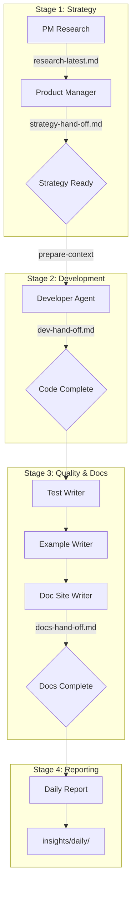

# AI Agents Building zkSDK

zkSDK is built entirely by autonomous AI agents using **Block's Goose framework** with **Qwen3-Coder-Plus** (32B) for code generation and **Claude Opus/Sonnet** for strategic planning. The complete development pipeline runs 24/7 in the public `zksdkjs/privacy-agent` repository.

## 🤖 Why Goose + Qwen?

### Goose Framework
- **Local-first execution** - Full repository access, no cloud dependencies
- **Recipe-based workflows** - Encode Fortune 500 management patterns
- **Persistent memory** - Agents never restart from scratch
- **Multi-model routing** - Best model for each task

### Model Selection
- **Qwen3-Coder-Plus (32B)** via OpenRouter
  - Primary coding model
  - High throughput, excellent TypeScript/Rust
  - Used for: Developer, Tester, Example Writer

- **Claude Opus/Sonnet** via Anthropic
  - Strategic planning and research
  - Used for: Product Manager, Strategy Chief, Researcher

## 🏗️ Agent Architecture

### Pipeline Stages



## 📋 Agent Roster

### Main Workflow Agents

#### 1. Developer Agent
**Recipe:** `.goose/recipes/main/recipe-developer.yaml`
**Model:** Qwen3-Coder-Plus (32B)
**Script:** `automation/scripts/run-developer.sh`

**Responsibilities:**
- Implement new SDK features and providers
- Fix bugs and refactor code
- Update `sdk/packages/**` structure
- Write initial tests
- Document code changes

**Outputs:**
- Code in `sdk/`
- `workspace/hubs/dev-hand-off.md`
- Session logs in `workspace/sessions/`

**Recent Work (Oct 2025):**
- Built `@zksdk/wallet-connect` package
- Implemented auto-provider detection
- Created Railgun & Aztec adapters

#### 2. Test Writer Agent
**Recipe:** `.goose/recipes/main/recipe-tester.yaml`
**Model:** Qwen3-Coder-Plus (32B)
**Script:** `automation/scripts/run-test-writer.sh`

**Responsibilities:**
- Write comprehensive test suites (Jest)
- Improve code coverage (target: 90%)
- Integration testing across providers
- Performance benchmarking
- Security validation

**Outputs:**
- Tests in `sdk/packages/**/__tests__/`
- Coverage reports in `sdk/coverage/`
- `workspace/hubs/docs-hand-off.md` (appends)

**Recent Achievements:**
- Core package: 0% → 100% coverage
- Added 34 new tests
- Overall coverage: 41% → 43.7%

#### 3. Product Manager Agent
**Recipe:** `.goose/recipes/main/recipe-product-manager.yaml`
**Model:** Claude Opus
**Script:** `automation/scripts/run-product-manager.sh`

**Responsibilities:**
- Define product strategy and requirements
- Create user personas and use cases
- Technical architecture planning
- Go-to-market strategy
- Metrics and success criteria

**Outputs:**
- `strategy/product/*.md`
- `workspace/hubs/strategy-hand-off.md`
- Product requirements and roadmaps

**Key Documents:**
- User personas
- Market analysis
- Technical architecture
- MVP → v1.0 → v2.0 requirements

#### 4. Privacy Cash Researcher
**Recipe:** `.goose/recipes/main/recipe-privacy-cash-researcher.yaml`
**Model:** Claude Opus
**Script:** `automation/scripts/run-pm-research.sh`

**Responsibilities:**
- Market research on privacy protocols
- Competitive analysis
- Developer needs assessment
- Technology trend analysis
- Research reports

**Outputs:**
- `insights/research/pm-market-research-*.md`
- `workspace/hubs/research-latest.md`
- Market sizing and opportunity analysis

#### 5. Doc Site Writer Agent
**Recipe:** `.goose/recipes/main/recipe-doc-site-writer.yaml`
**Model:** Claude Opus
**Script:** `automation/scripts/run-doc-site-writer.sh`

**Responsibilities:**
- Marketing documentation
- Technical guides and tutorials
- Weekly/daily updates
- Blog posts and announcements
- SEO optimization

**Outputs:**
- `../zk-landing/docs/zksdkjs/privacy-sdk/**`
- `../zk-landing/docs/zksdkjs/building-sdk/**`
- `../zk-landing/docs/zksdkjs/ai-pipeline/**`
- `../zk-landing/docs/zksdkjs/updates/**`
- Architecture docs
- Integration guides

**Recent Updates (Oct 2025):**
- zkWalletConnect announcement
- Agent pipeline documentation
- Architecture guides
- Provider comparison tables

#### 6. Example Writer Agent
**Recipe:** `.goose/recipes/main/recipe-frontend-integration-examples.yaml`
**Model:** Qwen3-Coder-Plus (32B)
**Script:** `automation/scripts/run-example-writer.sh`

**Responsibilities:**
- Create usage examples
- Integration demos
- Quick-start templates
- Best practices code
- Framework-specific examples (React, Vue, etc.)

**Outputs:**
- `sdk/examples/**`
- `sdk/packages/wallet-connect/examples/`
- Integration templates

### Orchestration Agents

#### 7. Strategy Chief
**Recipe:** `.goose/recipes/main/recipe-strategy-chief.yaml`
**Model:** Claude Opus

**Responsibilities:**
- High-level roadmap planning
- Cross-agent coordination
- Risk assessment
- Priority calls
- Strategic pivots

#### 8. Task Coordinator
**Recipe:** `.goose/recipes/main/recipe-task-coordinator.yaml`
**Model:** Claude Sonnet

**Responsibilities:**
- Workflow orchestration
- Agent sequencing
- Dependency management
- Conflict resolution

### Provider Specialists

Located in `.goose/recipes/specialists/`:

- **Railgun Specialist** - EVM privacy deep dives
- **Aztec Specialist** - zkEVM integration expertise
- **Zama fhEVM Specialist** - Encrypted compute focus
- **Bitcoin Privacy Specialist** - Silent Payments & CoinJoin
- **Privacy Cash Specialist** - Solana ZK compression

### Utility Agents

Located in `.goose/recipes/utilities/`:

- **Session Reporter** - Daily summaries
- **Continue Work** - Resume interrupted sessions
- **Marketing & Growth** - Community engagement
- **Release Operations** - Deployment and launches
- **Social Media** - Twitter threads and content

## 🔄 Automation Pipeline

### Daily Workflow

```bash
# Stage 1: Strategy (morning)
./automation/scripts/daily-run-strategy.sh
# Runs: PM Research → Product Manager
# Output: strategy-hand-off.md

# Stage 2: Development (afternoon)
./automation/scripts/daily-run-dev.sh
# Runs: Developer Agent
# Output: dev-hand-off.md

# Stage 3: QA & Docs (evening)
./automation/scripts/daily-run-post-dev.sh
# Runs: Test Writer → Example Writer → Doc Site Writer → Daily Report
# Output: docs-hand-off.md, insights/daily/

# Or run Stage 2+3 together
./automation/scripts/daily-run-dev.sh --with-post-dev
```

### Context Preparation

Before each agent runs, `prepare-context.sh` aggregates workspace state:

```bash
# Combines:
- workspace/current/*.md       # Active sprint goals
- workspace/hubs/*.md           # Latest hand-offs
- workspace/sessions/latest     # Previous session notes
- strategy/active/current.md    # Active strategy

# Outputs:
.goose/data/context/current-session.md
```

### Hand-off System

Agents communicate via hand-off files in `workspace/hubs/`:

| File | Written By | Read By | Purpose |
|------|------------|---------|---------|
| `research-latest.md` | Researcher | Product Manager | Market insights |
| `strategy-hand-off.md` | Product Manager | Developer | Requirements |
| `dev-hand-off.md` | Developer | Test Writer | What was built |
| `docs-hand-off.md` | Test/Example/Doc Writers | External | Documentation status |
| `pipeline-log.md` | All | All | Audit trail |

### Memory System

Each agent maintains persistent state in `workspace/memory/`:

```
workspace/memory/
├── developer/          # Dev agent state
│   └── CURRENT_WORK.md
├── tester/             # Test agent state
│   └── current_task.md
└── ...                 # Other agent states
```

## 🛠️ Running Agents Locally

### Prerequisites

```bash
# Install Goose
curl -fsSL https://goose.build/install.sh | sh

# Configure API keys
goose configure
# Set ANTHROPIC_API_KEY for Claude
# Set OPENROUTER_API_KEY for Qwen
```

### Run Individual Agents

```bash
# Developer agent
./automation/scripts/run-developer.sh railgun feature 90

# Test writer
./automation/scripts/run-test-writer.sh wallet-connect 90

# Doc site writer
DOC_SITE_ROOT=../zk-landing ./automation/scripts/run-doc-site-writer.sh --scope weekly

# Product manager
./automation/scripts/run-product-manager.sh
```

### Run Full Pipeline

```bash
# Strategy + Dev + QA + Docs
./automation/scripts/daily-run-strategy.sh
./automation/scripts/daily-run-dev.sh --with-post-dev
```

### Resume Sessions

```bash
# List recent sessions
goose session list

# Resume specific session
goose session --resume --name developer_20251025_163406
```

## 📊 Agent Performance

### October 2025 Stats

| Agent | Sessions | Lines Written | Tests Added | Coverage Δ |
|-------|----------|---------------|-------------|------------|
| Developer | 12 | ~2,000 | - | - |
| Test Writer | 8 | ~1,500 | 34 | +2.5% |
| Example Writer | 5 | ~800 | - | - |
| Doc Writer | 10 | ~3,000 | - | - |
| PM/Research | 6 | ~5,000 | - | - |

### Success Metrics

- **Uptime:** 24/7 (agents resume automatically)
- **Code Quality:** All PRs pass CI before merge
- **Test Coverage:** Trending toward 90% target
- **Documentation:** Updated within 24 hours of code changes
- **Velocity:** ~500 lines of production code/day

## 🎯 Agent Coordination Rules

### Priority System

1. **Blockers** - Fix broken builds immediately
2. **Critical Features** - Wallet-connect, core providers
3. **Test Coverage** - Hit 90% across all packages
4. **Documentation** - Keep docs in sync with code
5. **Nice-to-Have** - Optimizations, refactors

### Conflict Resolution

- **Code Conflicts:** Developer agent wins, Test Writer adjusts
- **Strategy Conflicts:** Product Manager makes final call
- **Documentation Conflicts:** Doc Site Writer aligns with code reality

### Hand-off Protocol

1. Agent completes work
2. Updates hand-off file with summary
3. Logs to `pipeline-log.md`
4. Next agent reads hand-off before starting
5. Context refreshed via `prepare-context.sh`

## 🔍 Monitoring & Observability

### Session Logs

Every agent session is logged:
```
~/.local/share/goose/sessions/
├── developer_20251025_163406.jsonl
├── tester_20251025_165348.jsonl
└── ...
```

### Daily Reports

Comprehensive summaries generated daily:
```
insights/daily/2025/10-October/25/
└── daily-summary.md
```

### Pipeline Audit Trail

All agent activity logged:
```
workspace/hubs/pipeline-log.md
```

## 🚀 Future Enhancements

- **Multi-agent collaboration** - Agents working together in real-time
- **Automated PR creation** - Push directly to GitHub
- **CI/CD integration** - Run tests on every commit
- **Performance monitoring** - Track agent velocity and quality
- **Community agent** - Respond to GitHub issues automatically

## 📚 Resources

- **Goose Framework:** https://github.com/block/goose
- **Qwen Coder:** https://huggingface.co/Qwen
- **OpenRouter:** https://openrouter.ai/
- **Agent Recipes:** `.goose/recipes/` in privacy-agent repo
- **Pipeline Guide:** `/docs/zksdkjs/ai-pipeline/agent-pipeline`

---

**Last Updated:** October 25, 2025
**Active Agents:** 12 main + 5 specialists + 7 utilities
**Framework:** Goose by Block
**Models:** Qwen3-Coder-Plus (32B), Claude Opus/Sonnet
