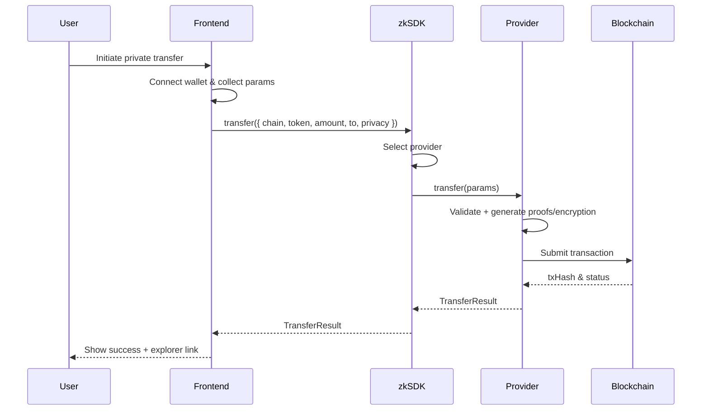
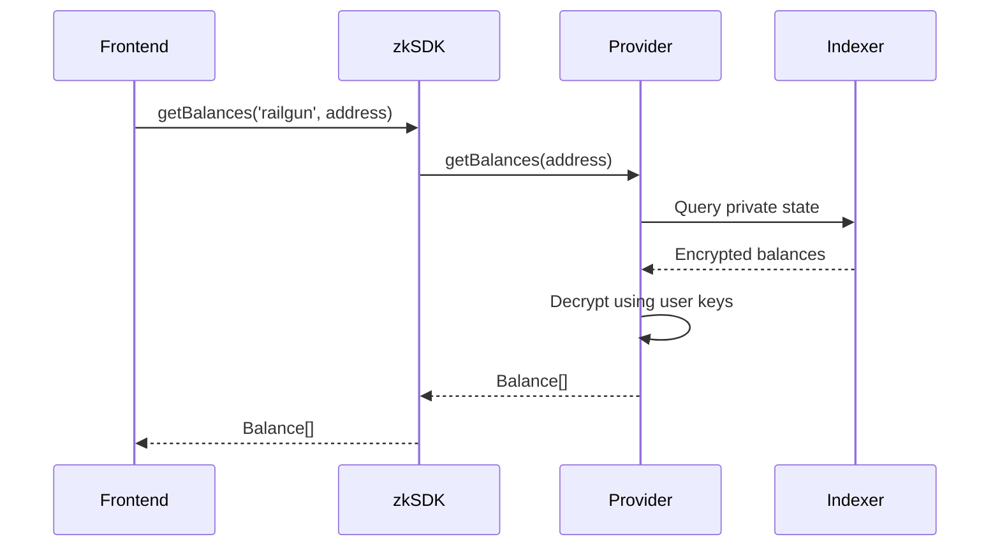

# zkSDK Architecture Overview

**Version**: 1.0.0-beta  
**Last Updated**: 2025-10-22

> “The LangChain of Privacy” — a universal SDK for private blockchain transactions.

## System Overview

zkSDK provides a **unified API** for executing private transactions across multiple privacy protocols. It abstracts protocol differences behind a consistent TypeScript interface designed for both browser and Node.js runtimes.

### Core Design Principles

- **Unified API** for all privacy providers.
- **Provider agnostic**: Railgun, Aztec, FHEVM, Privacy Cash, Bitcoin (and future additions).
- **Modular architecture**: each provider evolves independently.
- **Type safety** with strict TypeScript definitions.
- **Environment flexibility**: works in browser and Node.js.

## Architecture Layers

```
┌─────────────────────────────────────────────────────────────────┐
│                    APPLICATION LAYER                            │
│  (Frontend: React/Vue/Next.js, Backend: Node.js/Express)       │
│                                                                 │
│  - User Interface                                              │
│  - Wallet Connections (MetaMask, Phantom, etc.)                │
│  - Business Logic                                              │
└────────────────────────────┬────────────────────────────────────┘
                             │
                             │ zkSDK API
                             │
┌────────────────────────────▼────────────────────────────────────┐
│                    @zksdk/core                                  │
│               Universal Privacy SDK Layer                       │
│                                                                 │
│  ┌──────────────────────────────────────────────────────────┐  │
│  │  ZkSDK                                                   │  │
│  │  - Provider Registry                                     │  │
│  │  - transfer(params, providerName?)                       │  │
│  │  - getBalances(providerName, address)                    │  │
│  │  - getTransactionStatus(providerName, txHash)            │  │
│  └──────────────────────────────────────────────────────────┘  │
│                                                                 │
│  ┌──────────────────────────────────────────────────────────┐  │
│  │  BasePrivacyProvider (Abstract)                          │  │
│  │  - initialize(config): Promise<void>                     │  │
│  │  - transfer(params): Promise<TransferResult>             │  │
│  │  - getBalances(address): Promise<Balance[]>              │  │
│  │  - getTransactionStatus(txHash): Promise<TransferResult> │  │
│  └──────────────────────────────────────────────────────────┘  │
└────────────────────────────┬────────────────────────────────────┘
                             │
           ┌─────────────────┼─────────────────┬────────────┐
           │                 │                 │            │
┌──────────▼────────┐ ┌─────▼──────┐ ┌────────▼─────┐ ┌────▼─────────┐
│  @zksdk/providers │ │  @zksdk/   │ │  @zksdk/     │ │  @zksdk/     │
│   /railgun        │ │  providers │ │  providers   │ │  providers   │
│                   │ │   /aztec   │ │   /fhevm     │ │   /privacy-  │
│ RailgunProvider   │ │            │ │              │ │   cash       │
│ - walletMnemonic  │ │ AztecProvider│ FHEVMProvider│ │PrivacyCash   │
│ - engineDbPath    │ │ - pxeConfig│ │ - signer     │ │Provider      │
│ - rpcEndpoints    │ │            │ │ - aclAddress │ │ - keypair    │
└──────────┬────────┘ └─────┬──────┘ └────────┬─────┘ └────┬─────────┘
           │                │                 │            │
┌──────────▼────────────────▼─────────────────▼────────────▼────────┐
│                   BLOCKCHAIN NETWORKS                             │
│                                                                   │
│  Ethereum │ Polygon │ Arbitrum │ Aztec L2 │ Zama │ Solana        │
│                                                                   │
│  - Public networks with privacy layers                           │
│  - Each provider routes to appropriate network(s)                │
└───────────────────────────────────────────────────────────────────┘
```

## Data Flow

### Transfer Execution



### Balance Query



## Provider Environments

| Provider | Browser | Node.js | Environment Notes |
|----------|---------|---------|-------------------|
| **Railgun** | ✅ | ✅ | IndexedDB (browser) or LevelDB (Node.js) for state. |
| **Aztec** | ⚠️ | ✅ | Requires PXE server connection. |
| **FHEVM** | ✅ | ✅ | Standard RPC + `fhevmjs` encryption. |
| **Privacy Cash** | ✅ | ✅ | Solana RPC + relay-backed compressed state. |
| **Bitcoin** | ✅ | ✅ | BIP352 Silent Payments; wallet-only, no full node. |

### Storage Requirements

- **Railgun**: IndexedDB (~50–200 MB) in browser; LevelDB file store in Node.js.
- **Aztec**: PXE server stores private state (local process or hosted).
- **FHEVM**: Minimal local storage; encryption artifacts cached per session.
- **Privacy Cash**: Solana keypair + relay-managed compressed commitments.
- **Bitcoin**: Encrypted Silent Payment keys; no heavy storage.

## Component Details

- **Provider Registry**: Maintains a map of provider instances keyed by protocol.
- **Transfer Orchestrator**: Normalizes transfer params, validates tokens/chains, and delegates to the target provider.
- **Proof Manager**: Coordinates proof generation/caching; tracks gas estimates and latency.
- **Telemetry Hooks**: Optional instrumentation to feed the metrics dashboard defined in `strategy/product/metrics-dashboard.md`.

## Security Model

- **Key Management**: Wallet mnemonics/keypairs provided by the caller; providers never persist secrets outside the configured storage.
- **Proof Verification**: Each provider verifies proofs locally before broadcasting transactions.
- **Sandboxing**: Browser builds restrict file access; server builds may isolate providers in worker threads.
- **Audits**: Railgun provider relies on upstream audits; other providers inherit security posture from their respective protocols (e.g., Aztec PXE, Zama fhEVM).

## Next Steps

- Promote Privacy Cash and Bitcoin providers from research prototypes to production-ready implementations.
- Expand telemetry integration to capture real-time metrics for the dashboard.
- Harden PXE orchestration for Aztec and add optional managed PXE support.
- Finalize cross-provider composability patterns (e.g., route selection, fallback strategies).
