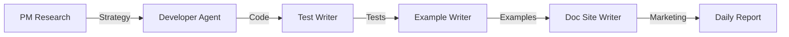

# zkSDK Overview

zkSDK is the universal privacy SDK - "The LangChain of Privacy" - built autonomously by AI agents in the public `zksdkjs/privacy-agent` repository. It provides a unified TypeScript interface for Railgun, Aztec, Zama's fhEVM, Bitcoin privacy tools, Solana's Privacy Cash, and future privacy stacks, eliminating the need to rewrite code for each chain.

visit https://github.com/zksdkjs/agent 

## 🎯 Core Philosophy

**One interface. Every blockchain. Continuous privacy.**

Write once, deploy anywhere. zkSDK abstracts away protocol-specific complexity while maintaining full access to advanced features when needed.

## 🏗️ Architecture Overview

### Package Structure

```
@zksdk/
├── core              # Runtime, types, SDK class
├── wallet-connect    # Unified wallet connection (NEW Oct 2025)
└── providers/
    ├── railgun       # Railgun EVM privacy
    ├── aztec         # Aztec zkEVM
    ├── fhevm         # Zama encrypted compute
    ├── bitcoin       # Silent Payments & CoinJoin
    └── light-protocol # Solana ZK compression
```

### Key Innovation: zkWalletConnect

**Problem:** Each privacy protocol requires different wallet setup and connection flows.

**Solution:** zkWalletConnect provides automatic provider detection and unified connection:

```typescript
import { zkWalletConnect } from '@zksdk/wallet-connect';

const wallet = new zkWalletConnect({
  preferredProvider: 'railgun',
  fallbackToAuto: true
});

await wallet.connect();
// Automatically detects and connects to available providers
```

## 🚀 Quick Start

### Installation

```bash
npm install @zksdk/core @zksdk/wallet-connect
# Add providers as needed
npm install @zksdk/providers-railgun @zksdk/providers-aztec
```

### Basic Usage

```typescript
import { ZkSDK } from '@zksdk/core';
import { zkWalletConnect } from '@zksdk/wallet-connect';

// Auto-connect to available privacy providers
const wallet = await zkWalletConnect.connect();

// Or configure manually
import { RailgunProvider } from '@zksdk/providers-railgun';
import { AztecProvider } from '@zksdk/providers-aztec';

const sdk = new ZkSDK({
  providers: {
    railgun: new RailgunProvider({
      rpcEndpoints: {
        ethereum: 'https://mainnet.infura.io/v3/YOUR_KEY'
      }
    }),
    aztec: new AztecProvider({
      pxeUrl: 'https://pxe.aztec.network'
    })
  },
  defaultProvider: 'railgun'
});

// Execute private transfer
await sdk.transfer({
  chain: 'ethereum',
  token: '0xA0b86...', // Token address
  amount: '1000000000000000000', // 1 ETH in wei
  to: '0x742d35...',
  privacy: 'anonymous'
});

// Check balances
const balances = await sdk.getBalances('railgun', userAddress);
```

## 📦 Package Status

| Package | Version | Coverage | Status |
|---------|---------|----------|--------|
| `@zksdk/core` | 0.1.0 | 100% | ✅ Stable |
| `@zksdk/wallet-connect` | 0.1.0 | - | ✅ Beta (Oct 2025) |
| `@zksdk/providers-railgun` | 0.1.0 | 48% | 🚧 Active Development |
| `@zksdk/providers-aztec` | 0.1.0 | 30% | 🚧 Active Development |
| `@zksdk/providers-fhevm` | 0.1.0 | 41% | 🧪 Experimental |
| `@zksdk/providers-bitcoin` | 0.1.0 | 41% | 🧪 Experimental |
| `@zksdk/providers-light-protocol` | 0.1.0 | 38% | 🧪 Experimental |

**Overall Test Coverage:** 43.7% (Target: 90%)
**Total Tests:** 72 passing

## 🤖 AI-Powered Development

zkSDK is built by autonomous agents using the Goose framework. The entire development pipeline runs automatically:

### Development Pipeline



**Core Scripts:**
```bash
# Strategy phase
./automation/scripts/daily-run-strategy.sh

# Development phase
./automation/scripts/daily-run-dev.sh

# QA & Documentation phase
./automation/scripts/daily-run-post-dev.sh

# Or run everything
./automation/scripts/daily-run-dev.sh --with-post-dev
```

### Agent Recipes

All agents are defined in `.goose/recipes/`:

**Main Workflows** (`.goose/recipes/main/`):
- `recipe-developer.yaml` - Code implementation
- `recipe-tester.yaml` - Test generation
- `recipe-product-manager.yaml` - Strategy & requirements
- `recipe-privacy-cash-researcher.yaml` - Market research
- `recipe-doc-site-writer.yaml` - Marketing documentation
- `recipe-frontend-integration-examples.yaml` - Usage examples

**Provider Specialists** (`.goose/recipes/specialists/`):
- `recipe-railgun-specialist.yaml`
- `recipe-aztec-specialist.yaml`
- `recipe-zama-fhe-specialist.yaml`
- `recipe-bitcoin-privacy-specialist.yaml`
- `recipe-privacy-cash-sdk.yaml`

**Utilities** (`.goose/recipes/utilities/`):
- `recipe-session-reporter.yaml` - Daily summaries
- `recipe-continue-work.yaml` - Resume sessions
- `recipe-marketing-growth.yaml` - Community updates

## 📊 Current Development Focus

**October 2025 Milestones:**
- ✅ zkWalletConnect package shipped
- ✅ Core package 100% test coverage
- ✅ Recipe→Step→ComboMeal system
- ✅ Automated pipeline integration
- 🔄 Test coverage 43% → 90%
- 🔄 Wallet-connect production ready
- 🔄 Railgun mainnet integration

## 🗂️ Repository Structure

The canonical source is `github.com/zksdkjs/privacy-agent`:

```
privacy-agent/
├── sdk/                      # SDK packages
│   └── packages/
│       ├── core/
│       ├── wallet-connect/
│       ├── recipes/
│       └── providers/
├── automation/
│   └── scripts/              # Pipeline automation
├── .goose/
│   └── recipes/              # Agent definitions
├── workspace/
│   ├── current/              # Active sprint
│   ├── memory/               # Agent state
│   ├── sessions/             # Daily logs
│   └── hubs/                 # Hand-off files
├── insights/
│   └── daily/                # Daily reports
└── strategy/
    ├── product/              # Product docs
    └── roadmap/              # Long-term plans
```

## 🔗 Resources

- **GitHub:** https://github.com/zksdkjs/privacy-agent
- **Documentation:** https://zksdkjs.com/docs
- **Daily Updates:** `/docs/zksdkjs/updates/`
- **Architecture:** `/docs/zksdkjs/building-sdk/architecture`
- **Agent Pipeline:** `/docs/zksdkjs/ai-pipeline/agent-pipeline`

## 📈 Progress Tracking

Development progress is tracked transparently:

**Daily Reports:** `insights/daily/YYYY/MM-Month/DD/daily-summary.md`
**Session Logs:** `workspace/sessions/YYYY-MM-DD/`
**Hand-offs:** `workspace/hubs/*.md`
**Sprint Status:** `workspace/current/sprint.md`

Every change is logged, every session is documented, every decision is recorded.

## 🎯 Getting Involved

1. **Explore the SDK:** Check examples in `sdk/examples/`
2. **Read Daily Updates:** Follow progress in `/docs/zksdkjs/updates/`
3. **Review Agent Work:** Read session logs in `workspace/sessions/`
4. **Contribute:** The agents welcome human contributions!

---

**Last Updated:** October 25, 2025
**Version:** 0.1.0 (Beta)
**Status:** Active Development
