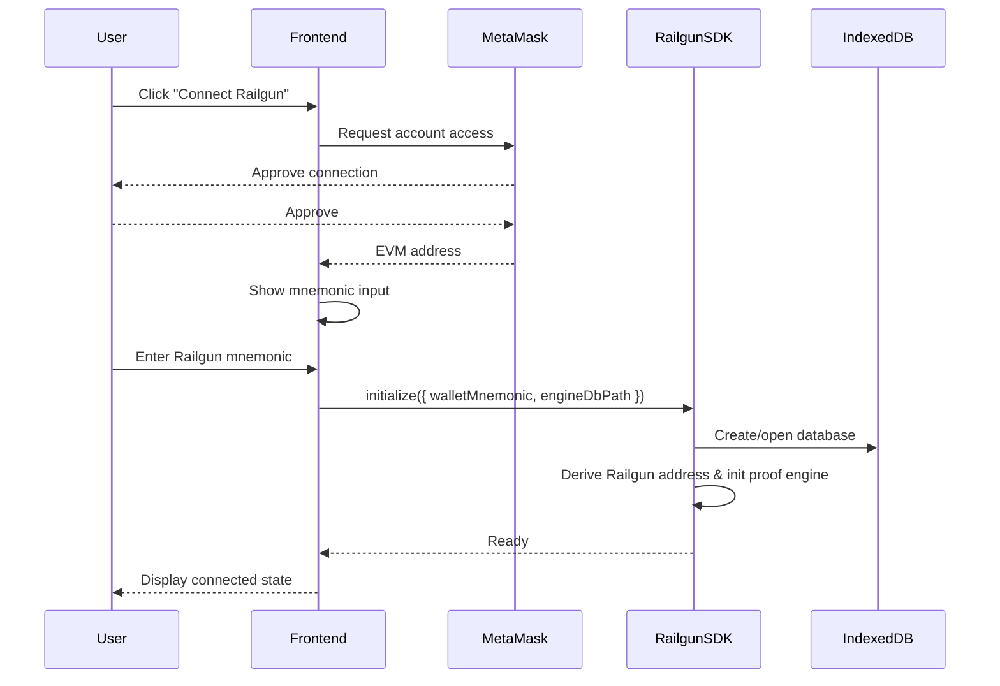
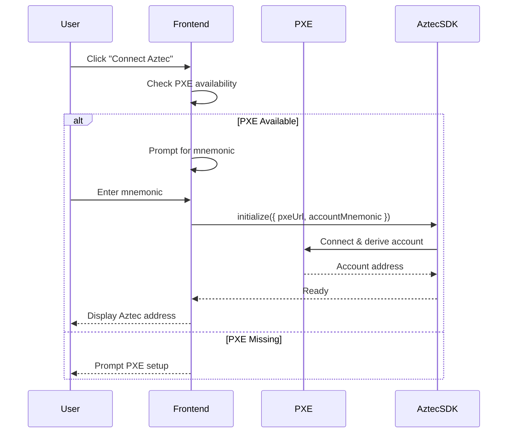
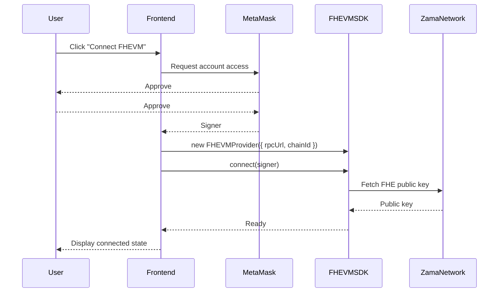
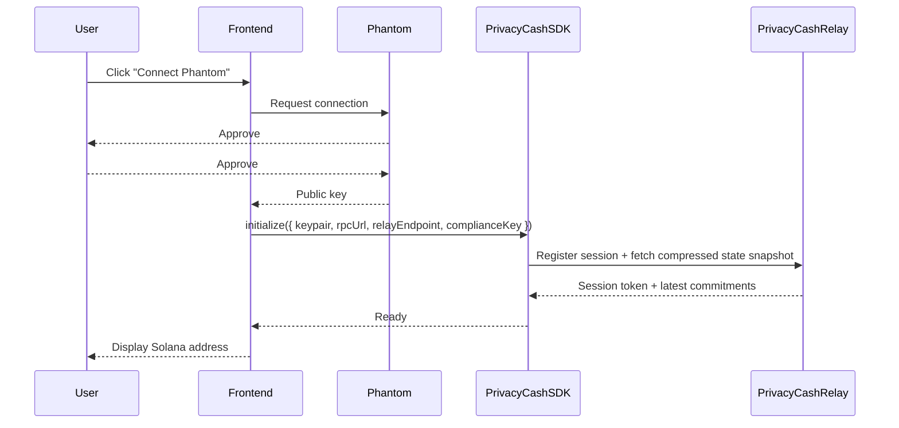
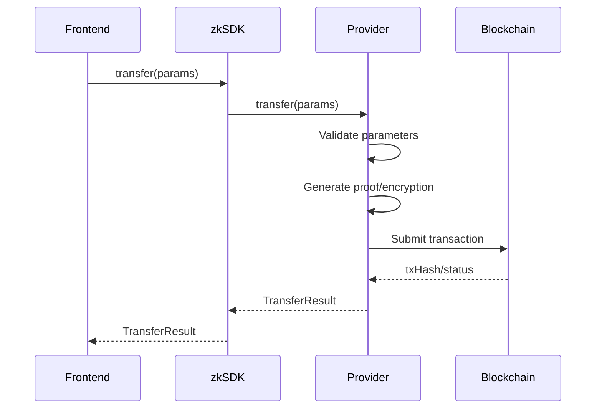
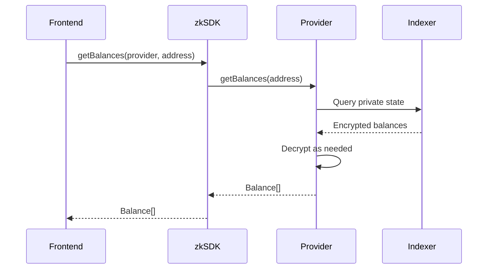
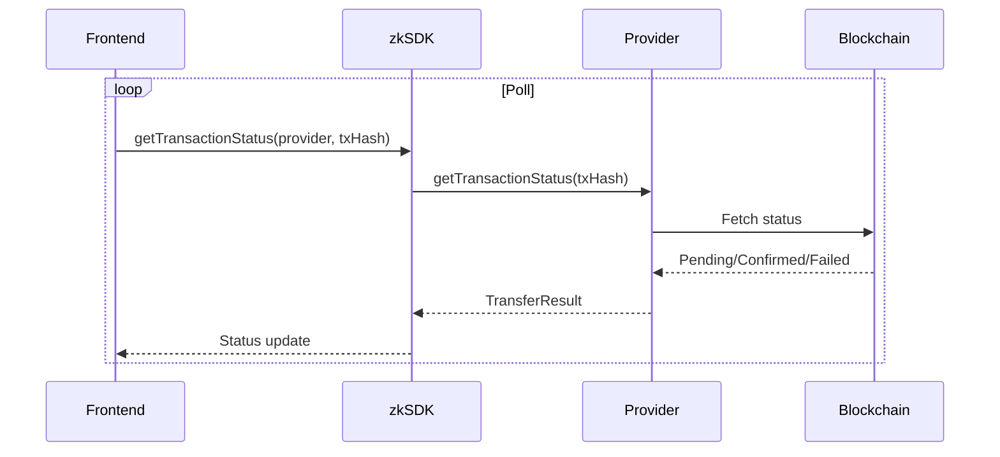

# zkSDK Integration Flows

**Version**: 1.0.0-beta  
**Last Updated**: 2025-10-22

Detailed sequence diagrams for common zkSDK operations.

## Frontend Wallet Connection

### Railgun



### Aztec



### FHEVM



### Privacy Cash (Solana)



## Provider Initialization Checklist

| Provider | Required Inputs | Optional Inputs | Notes |
|----------|-----------------|-----------------|-------|
| Railgun | Wallet mnemonic, engine DB path, RPC endpoints | Relayer config | Creates local proof engine + database. |
| Aztec | PXE URL, account mnemonic | Contract deployment config | Requires PXE server to be running. |
| FHEVM | RPC URL, chain ID, signer | Gateway URL | Fetches FHE public key on connect. |
| Privacy Cash | Solana keypair, RPC URL, relay endpoint | Compliance domain, intent expiry | Pulls compressed state via relay and enforces domain-specific policies. |
| Bitcoin | Silent payment key, electrum URL | Watch-only wallet path | Leverages BIP352 derivation paths. |

## Private Transfer Execution



## Balance Queries



## Transaction Status Tracking



## Error Handling Patterns

- **Validation errors**: Providers throw typed errors with remediation tips (`InvalidMnemonicError`, `MissingConfigError`, etc.).
- **Network errors**: Retry with exponential backoff; escalate to UI with actionable message.
- **Proof failures**: Providers include failure codes (e.g., `PROOF_VERIFICATION_FAILED`, `INSUFFICIENT_PRIVACY_BALANCE`).
- **PXE availability**: Detect early and surface instructions to start the PXE server.

## Multi-Provider Setup

```typescript
import { ZkSDK } from '@zksdkjs/core';
import { RailgunProvider } from '@zksdkjs/providers/railgun';
import { FHEVMProvider } from '@zksdkjs/providers/fhevm';

const sdk = new ZkSDK({
  providers: {
    railgun: new RailgunProvider(),
    fhevm: new FHEVMProvider(),
  },
  defaultProvider: 'railgun',
});

await sdk.initializeProvider('railgun', railgunConfig);
await sdk.initializeProvider('fhevm', fhevmConfig);
```

### Routing Strategy

- Default provider handles most operations.
- Applications can override provider per call (`sdk.transfer(params, 'aztec')`).
- Fallback logic can inspect provider health metrics before routing.
